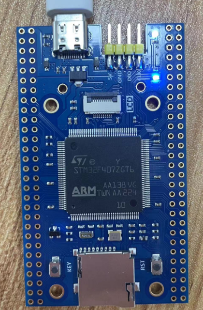

# 硬件介绍

项目硬件使用的开发板为[FK407M2-ZGT6](https://item.taobao.com/item.htm?spm=4468m.1.0.0.10a52dc8ekqmQn&id=588438707815&ns=1&abbucket=15#detail)。

## STM32F407ZGT6 硬件介绍

STM32F407系列面向需要在小至10x10mm的封装内实现高集成度、高性能、嵌入式存储器和外设的医疗、工业与消费类应用。

STM32F407/417提供了工作频率为168 MHz的Cortex™-M4内核（具有浮点单元）的性能。

性能：在168MHz频率下，从Flash存储器执行时，STM32F407能够提供210 DMIPS/566 CoreMark性能，并且利用意法半导体的ART加速器实现了FLASH零等待状态。DSP指令和浮点单元扩大了产品的应用范围。

功效：该系列产品采用意法半导体90nm工艺和ART加速器，具有动态功耗调整功能，能够在运行模式下和从Flash存储器执行时实现低至238µA/MHz的电流消耗（@168MHz）。

丰富的连接功能：出色的创新型外设：与STM32F4x5系列相比，STM32F407产品还具有符合IEEE 1588 v2标准要求的以太网MAC10/100和能够连接CMOS照相机传感器的8~14位并行照相机接口。

- 2个USB OTG（其中一个支持HS）
- 音频：专用音频PLL和2个全双工I²S
- 通信接口多达15个（包括6个速度高达11.25Mb/s的USART、3个速度高达45Mb/s的SPI、3个I²C、2个CAN和1个SDIO）
- 模拟：2个12位DAC、3个速度为2.4MSPS或7.2 MSPS（交错模式）的12位ADC
- 定时器多达17个：频率高达168MHz的16和32位定时器
- 可以利用支持Compact Flash、SRAM、PSRAM、NOR和NAND存储器的灵活静态存储器控制器轻松扩展存储容量
- 基于模拟电子技术的真随机数发生器
- STM32F417还整合了加密/HASH处理器，为AES 128、192、256、3DES和HASH（MD5、SHA-1）实现了硬件加速。

## 开发板硬件介绍

核心板资源如下：
- 主频168MHz
- 片内1M Flash
- 192K SRAM
- 1个SPI液晶接口
- 1个TF卡接口
- 1个复位按键，1个用户按键
- 1个用户LED
- 通过排针引出SWD和串口
- 引出108个IO口
- 工作环境温度-40~85℃

以下引脚固定为对应功能，其他引脚全部引出。

| 引脚   | 功能              |
| :---: | :---------------: |
| PA15  | KEY               |
| PC13  | LED               |
| PH0   | RCC_OSC_IN        |
| PH1   | RCC_OSC_OUT       |
| PC14  | RCC_OSC32_IN      |
| PC15  | RCC_OSC32_OUT     |
| PA13  | SYS_JTMS-SWDIO    |
| PA14  | SYS_JTMS-SWCLK    |
| PA9   | USART1_TX         |
| PA10  | USART1_RX         |
| PA11  | USB_OTG_FS_DM     |
| PA12  | USB_OTG_FS_DP     |
| PC8   | SDMMC1_D0         |
| PC9   | SDMMC1_D1         |
| PC10  | SDMMC1_D2         |
| PC11  | SDMMC1_D3         |
| PC12  | SDMMC1_CLK        |
| PD2   | SDMMC1_CMD        |